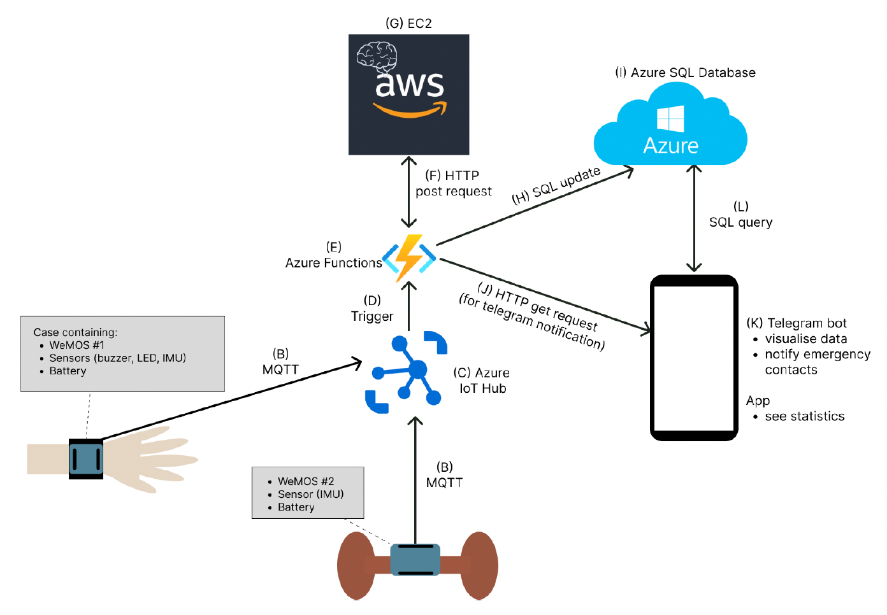
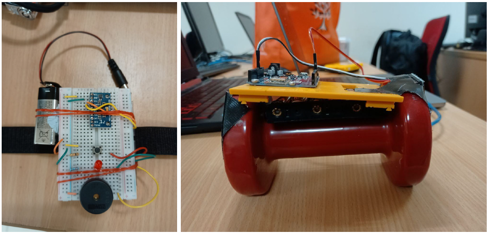
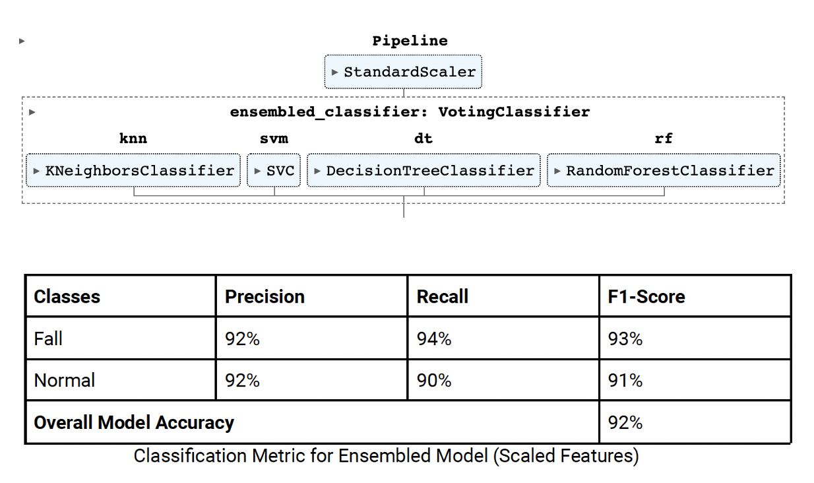
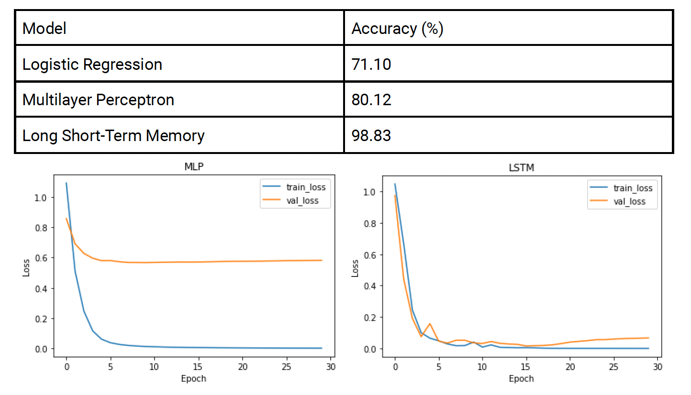

# The BOYD (Body Observation with Yesterday’s Data) Project

## Overview
BOYD is an IoT-driven healthcare monitoring system designed for elderly care. It uses two primary IoT devices: a fall detector wristband and an exercise tracker dumbbell. These devices connect to cloud services for real-time data analysis and notification, ensuring improved healthcare and monitoring for the elderly.

---

## Features
- **Fall Detection**: Detects falls and alerts caregivers via a Telegram bot.
- **Exercise Tracking**: Tracks exercises for fitness or physiotherapy using IMU sensors.
- **Real-Time Notifications**: Integrated Telegram bot for emergency alerts and daily activity updates.
- **Data Visualization**: Progressive Web App (PWA) for monitoring and analyzing user data.
- **Cloud Integration**: Uses Azure IoT Hub and AWS EC2 for data processing and machine learning.

---

## System Architecture
BOYD leverages a cloud-based architecture:

1. **IoT Devices**:
   - Wristband: Detects falls using IMU sensors.
   - Dumbbell: Tracks various exercise activities.
2. **Cloud Services**:
   - Azure IoT Hub for device communication.
   - Azure Functions for serverless data processing.
   - AWS EC2 for machine learning predictions.
3. **Communication Protocols**:
   - MQTT for IoT device data transmission.
   - HTTP for API interactions.
4. **User Interaction**:
   - Telegram Bot for notifications and queries.
   - PWA for data visualization.

### Architecture Diagram

---

### Device Design
- **Wristband**:
  - Components: IMU sensor, WeMos microcontroller, LED, push-button, buzzer.
  - Usage: Fall Detection

- **Dumbbell**:
  - Components: IMU sensor, WeMos microcontroller, power supply.
  - Usage: Exercise Tracking

- The following figure showcases the design of the wristband and the sensor mounted dumbell:

---

## Machine Learning Models
The machine learning aspect of BOYD is central to its functionality, enabling precise fall detection and exercise tracking:

### Fall Detection: Ensemble Model
- **Models Used**: Support Vector Machines, Decision Trees, and ensemble techniques.
- **Performance**: Achieved a 92% overall accuracy using ensembled models.

- **Features**: Processes IMU data to detect falls and minimize false positives.
- **Deployment**: Hosted on AWS EC2 instances with Flask APIs for prediction services.
- The following represents the ensemble model used and the its overall performance on the respective classes:

### Exercise Tracking: LSTM Sequence Model
- **Models Used**: Logistic Regression, Multilayer Perceptron (MLP), and Long Short-Term Memory (LSTM).
- **Performance**: LSTM achieved 97.95% accuracy, outperforming other models.

- **Features**: Uses sliding window techniques to analyze movement sequences.
- **Deployment**: Similar to the fall detection model, deployed via Docker on AWS EC2.
- The following showcases the performance of of the Multi-Layer Perceptron compared with the performance of the LSTM.

### Data Pipeline
- **Data Collection**: IMU sensors transmit data via Flask scripts to CSV files for preprocessing.
- **Preprocessing**: Includes normalization and feature scaling for improved model accuracy.
- **Inference**: Real-time predictions provided through Dockerized ML APIs.

---

## Data Collection Process
BOYD collects data from IoT devices to ensure accurate analysis and predictions:

1. **Device Sensors**:
   - IMU sensors on the wristband and dumbbell capture motion and orientation data in real-time.
   - Data includes acceleration, gyroscopic readings, and angular velocity.

2. **Transmission**:
   - Collected data is transmitted to the cloud via MQTT protocol for minimal latency.
   - Data is stored temporarily on the devices to handle intermittent connectivity.

3. **Storage**:
   - Data is processed and stored in CSV format on cloud storage systems for preprocessing.
   - Separate storage is maintained for fall detection and exercise tracking datasets.

4. **Preprocessing**:
   - Data is normalized and cleaned to remove noise or anomalies.
   - Features are extracted for machine learning models, including time-series patterns.

5. **Security and Privacy**:
   - All data transmission is encrypted using SSL/TLS.
   - User data is anonymized to comply with privacy regulations.

---

## Azure IoT Hub Utilization
Azure IoT Hub plays a critical role in connecting and managing IoT devices in the BOYD system:

1. **Device Communication**:
   - Facilitates secure and bi-directional communication between devices and the cloud.
   - Ensures reliable transmission of IMU sensor data to the Azure cloud.

2. **Device Provisioning**:
   - Simplifies onboarding of IoT devices using automated provisioning tools.

3. **Telemetry Data**:
   - Streams real-time telemetry data for monitoring and storage.
   - Supports MQTT and HTTP protocols for efficient communication.

---

## Azure Functions
Azure Functions provide serverless computing capabilities to process IoT data efficiently:

1. **Data Ingestion**:
   - Processes telemetry data received from IoT Hub in near real-time.
   - Filters and forwards relevant data to appropriate storage or processing layers.

2. **Event-Driven Architecture**:
   - Integrates seamlessly with storage and machine learning workflows.

3. **Scalability**:
   - Dynamically scales based on incoming data loads, ensuring cost efficiency.

---

## Azure SQL Database
Azure SQL Database is utilized for structured data storage and query management in the BOYD system:

1. **Data Integration**:
   - Serves as the central repository for processed data from Azure Functions.

2. **Structured Query Capabilities**:
   - Enables complex queries for generating detailed reports on fall detection and exercise tracking.

3. **Scalability and Security**:
   - Ensures robust data encryption and access control through Azure Active Directory.

---

## AWS EC2 Cloud Processing
AWS EC2 provides the computational backbone for BOYD's machine learning components:

1. **Model Hosting**:
   - Two Seperate EC2 instances were launched, each deploying Dockerized machine learning models for fall detection and exercise tracking respectively.
   - Ensures high availability and low-latency inference.

2. **Model Security**:
   - EC2 instances require key pair authentication for access, which prevents unauthorized users from accessing the instances.
   - Since Docker containers are used to deploy models and their dependencies securely within EC2 instances, reducing the risk of configuration issues and ensuring that only authorized operations occur within these isolated environments​
.

---

## Telegram Bot
The Telegram bot integrates seamlessly with the system to provide:
- **Emergency Alerts**: Notifies caregivers in the event of a fall.
- **Activity Summaries**: Provides regular updates on exercise and activity levels.
- **Command Interface**: Supports commands like `/checkin`, `/exercise`, and `/help` to query the system.

### Command Overview
| Command         | Description                         |
|-----------------|-------------------------------------|
| `/checkin`      | View user activity level            |
| `/exercise`     | View total exercise time            |
| `/exercisehistory` | View detailed exercise history      |
| `/help`         | List all available commands         |

---

## Website (PWA)
The Progressive Web App (PWA) complements the Telegram bot by offering:
- **Visual Dashboards**: Displays detailed charts and data about user activities.
- **Mobile Responsiveness**: Works seamlessly on both desktop and mobile devices.
- **Ease of Use**: Can be added to a mobile home screen for quick access.

### Features
- View fall history and exercise tracking data.
- Access video tutorials for exercises.
- Progressive enhancements with offline capabilities.

---

## Power Consumption
The system has been optimized for energy efficiency:

- **Wristband**:
  - Operates in idle state most of the time, consuming 10mA.
  - Transmits data only when necessary, consuming 120mA during transmission.
  - Battery life: ~55 hours in idle state, ~4.5 hours during continuous transmission.

- **Dumbbell**:
  - Consumes 120mA continuously due to frequent data transmission.
  - Battery life: ~4.5 hours with a standard 9V power supply.

---

## Acknowledgments
- Developed as part of CS3237 Introduction to Internet of Things.
- Guidance provided by Prof. Boyd Anderson
- Project-Team: Marcus Ng, Marcus Tan, Mooi Suet Yeng, Neil Banerjee, and Shreyas Kumar.

---

## References
- Azure IoT Hub Documentation: [Azure IoT Hub](https://azure.microsoft.com/en-us/products/iot-hub/)
- AWS EC2 Documentation: [AWS EC2](https://aws.amazon.com/ec2/)
- Python Telegram Bot: [Telegram Bot API](https://pypi.org/project/python-telegram-bot/)

---
